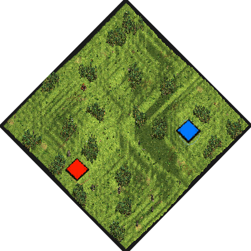
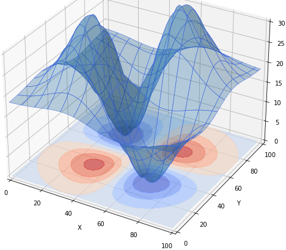

# 3D Plot
by ArthurXIV

### Map features
- The idea was to have Arabia but with elevation z=xy*exp(-x²-y²). I did code the elevation correctly but dislike the end result, so i won't finish this map.

### Introduction
-

### Map icon

### Targeted result for elevation
