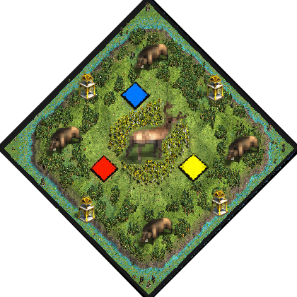

# Deer Glade
by ArthurXIV

### Map icon

### Map features
- Circular map:

>Center: &nbsp; &nbsp; &nbsp; 2 Relics, lots of Deer.  
>1st ring: &nbsp; &nbsp; &nbsp; sparse Birch trees.  
>2nd ring: &nbsp; &nbsp; &nbsp; Players and Deer. High proximity.  
>3rd ring: &nbsp; &nbsp; &nbsp; Wood line and Boars.  
>4th ring: &nbsp; &nbsp; &nbsp; Relics, Crocodiles and few fish on Shallow terrain. Allows naval Trade.  

- expensive towers (+76 stone)

- Starter:

> 9 or 3 villagers  
> Scout  
> Merchant  
> Donkey (can trade)  

### Introduction
This green island located in a swampy area homes a throng of deer. You may find
them if you wander through the birch brush.