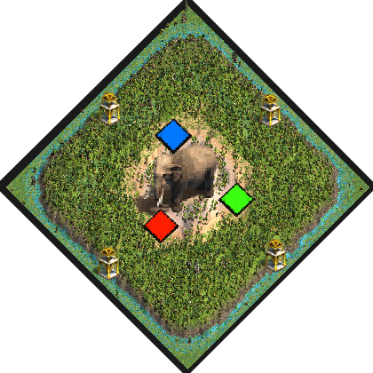

# Hunt Rush
by ArthurXIV

### Map icon

### Map features
- Circular map:

>Center: &nbsp; &nbsp; &nbsp; 4 Relics, lots of Elephants on Beach terrain. Walls only.  
>1st ring: &nbsp; &nbsp; &nbsp; still Beach terrain.  
>2nd ring: &nbsp; &nbsp; &nbsp; Players. Very high proximity. Cramped space for buildings.  
>3rd ring: &nbsp; &nbsp; &nbsp; messy Rainforest.  
>4th ring: &nbsp; &nbsp; &nbsp; Relics, Crocodiles and few fish on Shallow terrain. Allows naval Trade.  

- expensive towers (+76 stone)

- Starter:

> 9 or 3 villagers  
> Scout  
> Merchant  
> Donkey (can trade)  

### Introduction
This strange island located in a swampy area homes a wild variety of fauna and
vestige. Far from the coast, the very dry land is occupied only by a few zebra
and a vast pack of elephants.