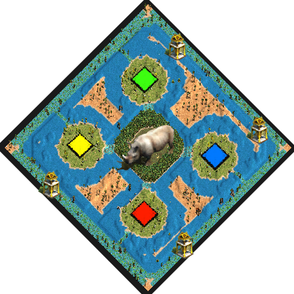

# Rhino Wetlands
by ArthurXIV

### Map icon

Put this .png in the following folder if you want it displayed ingame in the map selection screen:  
C:\Program Files (x86)\Steam\steamapps\common\AoE2DE\resources\_common\random-map-scripts

### Map features
- Circular map:

>Center: &nbsp; &nbsp; &nbsp; 4 Relics, lots of Rhinos on Shallow terrain.  
>1st ring: &nbsp; &nbsp; &nbsp; Wood wall.  
>2nd ring: &nbsp; &nbsp; &nbsp; Player islands and neutral islands. Cramped space for buildings.  
>3rd ring: &nbsp; &nbsp; &nbsp; Shallow connection.  
>4th ring: &nbsp; &nbsp; &nbsp; Relics and Crocodiles on Shallow terrain.  

- expensive towers (+76 stone)
- low hp warships (div by 2)

- Starter:

> 3 villagers (can be set to 9, just deactivate the comment)  
> Scout  
> Merchant  
> Donkey (can trade)  
> Junk (can trade)  
> Trade Cog  
> Transport Ship  
> Fishing Ship  

### Introduction
This archipelago is centered around an island covered with a dense forest. Adventurers who managed to penetrate this forest distinctly remember facing a throng of rhinos and fleeing by boat immediately.