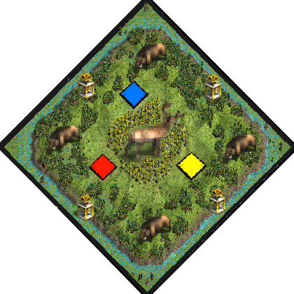

# Deer Glade
by ArthurXIV

### Map icon

Put this .png in the following folder if you want it displayed ingame in the map selection screen:  
C:\Program Files (x86)\Steam\steamapps\common\AoE2DE\resources\_common\random-map-scripts

### Map features
- Circular map:

>Center: &nbsp; &nbsp; &nbsp; 2 Relics, lots of Deer.  
>1st ring: &nbsp; &nbsp; &nbsp; sparse Birch trees.  
>2nd ring: &nbsp; &nbsp; &nbsp; Players and Deer. High proximity.  
>3rd ring: &nbsp; &nbsp; &nbsp; Wood line and Boars.  
>4th ring: &nbsp; &nbsp; &nbsp; Relics, Crocodiles and few fish on Shallow terrain. Allows naval Trade.  

- expensive towers (+76 stone)

- Starter:

> 3 villagers (can be set to 9, just deactivate the comment)  
> Scout  
> Merchant  
> Donkey (can trade)  

### Introduction
This green island located in a swampy area homes a throng of deer. You may find
them if you wander through the birch brush.